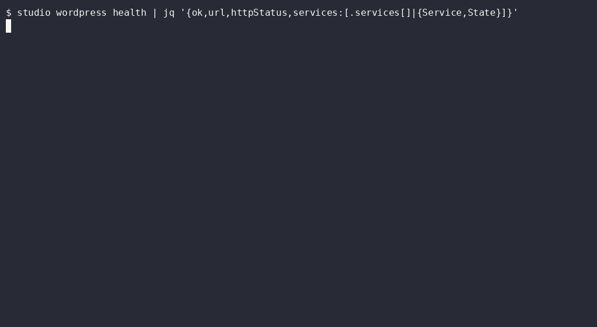

# Studio Control Plane

A local-first control plane for freelancers and small web/software studios, with
WordPress website delivery as a first-class operating surface. It connects client
acquisition, commercial work and delivery to Dockerized WordPress environments,
repositories, evidence and the context needed to continue work across AI-agent runs.

The system keeps business and implementation records linked: why a site or project
exists, what was agreed, where its code and runtime live, what has been verified and
what should happen next. A React panel, CLI and MCP interface operate on shared
domain services.

## From prospect to delivered work

**Prospect → opportunity → discovery → proposal → client / engagement →
deliverable / project → evidence → portfolio case**

Commands record prospect research and discovery, prepare and review proposals,
record acceptance and convert opportunities into clients and engagements. Delivery
records connect the resulting work to projects, repositories and environments.
Evidence supports acceptance, release and portfolio decisions. These are linked
domain operations; the panel exposes selected forms and views rather than a
dedicated wizard for every transition.

| Area | Implemented system |
| --- | --- |
| Client and commercial operations | People, organizations, prospects, opportunities, discovery, proposals, clients and engagements |
| Website and software delivery | Deliverables, projects, repository registration, environments, products and releases |
| WordPress operations | Docker Compose runtime control, WP-CLI, plugin inspection, database/uploads backup and restore checks |
| Finance | Contracts, invoices, payment records and obligation tracking |
| Evidence and publication planning | Evidence registration, portfolio cases, campaigns and content preparation |
| Agent continuity and governance | Tasks, decisions, agent runs, context packs, observations, verification, handoffs and learning records |
| Career pipeline | Opportunity/application records and evidence-backed preparation within the same operational model |

Finance records track operational state; they do not process payments. Content and
commercial preparation remain distinct from external publication or sending.

## WordPress website delivery

WordPress is the strongest concrete delivery specialization in the current system.
The domain model and repository topology are designed so client engagements and
deliverables can be linked to independent website repositories and environments,
instead of flattening every client site into one shared Git history.

The current implementation includes a registered local WordPress portfolio runtime
and [runtime adapters](packages/adapters/src/index.ts) for Docker Compose
status/start/stop, HTTP health inspection, WP-CLI commands, plugin inspection,
database/uploads backups and restore checks. A
[portfolio site kit](packages/adapters/src/wordpress-site-kit.ts) applies the
included site capsule to a local WordPress/Elementor runtime.



The registered WordPress runtime and its active plugins can be inspected from the
same CLI that manages delivery records.

This makes the control plane useful beyond record keeping: it can observe and operate
parts of the actual environment used to build and verify WordPress work. The
[repository topology](docs/studio-os/architecture/04-repository-wordpress-topology.md)
describes the intended boundary between the coordinator, reusable products,
portfolio sites and client website repositories.

`wordpress provision` currently creates a target directory and provisioning
manifest; it does not complete site installation or registration. Richer automated
client-site bootstrapping and delivery workflows remain architectural direction
where the runtime does not yet implement them.

## Continue work across agent runs

**Agent run → context pack → observations / actions → verification → handoff**

The agent harness records scope, authority, observations and evidence so a later
run can resume from explicit state. Shared commands validate mutations and entity
revisions. Prepared actions bind confirmation to an exact payload checksum and an
expiry; execution and reconciliation record their outcomes separately.

The [agent harness](packages/core/src/harness/agent-harness.ts) and
[prepared-action service](packages/core/src/prepared-actions/service.ts) implement
these mechanisms. Context packs and handoffs are executable capabilities; richer
client-memory and briefing models in the PRDs remain architectural direction.

## System map

| Layer | Responsibility |
| --- | --- |
| [React panel](apps/panel/src) | CRM, delivery, products, finance, agents and operational control views |
| [Local API](packages/local-api/src), [CLI](packages/cli/src), [MCP](packages/mcp/src) | Human and automation entry points |
| [Core services](packages/core/src/domains) and [command registry](packages/core/src/commands/registry.ts) | Domain operations, validation and lifecycle transitions |
| [Schemas](packages/schemas/src) | Entity, relationship, command and result contracts |
| [Storage](packages/storage/src) | Canonical YAML/Markdown records and a rebuildable SQLite projection |
| [Adapters](packages/adapters/src) | Repository inspection, local WordPress runtime and external-action boundaries |

Canonical files are the durable source of truth; SQLite supports queries and the
dashboard. The [implementation guide](docs/studio-os/reviewer-guide.md) provides a
source-reading path. The [documentation index](docs/studio-os/00-index.md) links
runtime references and the broader design specifications.

## Run locally

The declared toolchain is Node.js 24.16.0 and npm 11.13.0. Installation builds
native SQLite dependencies. Inspect the checkout's operational records and
environment paths before operating an existing workspace.

```bash
git clone https://github.com/KingDonRush/studio-control-plane.git
cd studio-control-plane
npm ci
npm run build
npm run studio -- inspect
npm run studio -- dashboard --serve
```

The built panel and API use the loopback address configured in `studio.config.yaml`
(default `127.0.0.1:4177`). For panel development, keep the API running and use
`npm run dev:panel`; Vite proxies API requests from port 5177 to 4177. WordPress
operations additionally require Docker and a configured environment.

## Verification and current boundaries

```bash
npm run verify
```

This runs TypeScript checking, 65 tests, Biome and workspace builds. Tests exercise
domain commands, storage, lifecycle controls, agent continuity and adapter
contracts. Docker/WordPress deployment and external service behavior require
their own environment checks; a unit test does not establish a live deployment.

Git and local Docker/WordPress adapters have executable implementations. GitHub
and communication providers remain fake or disabled in the supplied configuration.
A prepared or confirmed record alone does not mean an external action completed.

The system assumes a trusted local operator and loopback access, without a hosted
multi-tenant authorization model. The CLI name `studio`, `@guilherme-studio/*`
packages, existing record IDs and `studio.guilherme.dev/*` contracts retain their
compatibility identities. The repository rename does not migrate stored records
or rename existing local directories.
