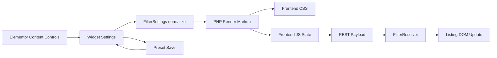

# Filter Controller Robustness Source Map

Date: 2026-06-05

Task: `TASK-FC-028`
Subplan: `SUBPLAN-FC-ROBUSTNESS-AUDIT`

Status: source map complete, implementation not started.

## Purpose

This map identifies which files own each part of the Filter Controller behavior.
It is the minimum source context required before changing visual controls,
dynamic tags, layout packing, presets, or resolver semantics.

## Data Flow

## Ownership Matrix

| Layer | Primary file | Current responsibility |
|---|---|---|
| Widget registration/render | `includes/Elementor/Widgets/FilterController.php` | Renders filter groups, sort, actions, data attributes, range icon overlays, labels, and per-filter layout span. |
| Content controls | `includes/Elementor/FilterController/ContentControls.php` | Defines target listing, filter repeater, field binding, sort controls, and hidden style-cadence flags. |
| Style controls | `includes/Elementor/FilterController/StyleControls.php` | Defines layout, fields, generic options, range, rating, buttons, chips/count, pagination, and state controls. |
| Filter settings normalization | `includes/Elementor/FilterController/FilterSettings.php` | Resolves presets, normalizes filters, extracts effective keys from manual and dynamic bindings, maps presets back to widget settings. |
| Filter type definitions | `includes/Elementor/FilterController/FilterTypes.php` | Lists filter types and default local widget filters. |
| Option parsing | `includes/Elementor/FilterController/FilterOptions.php` | Parses option text and default rating options, including swatch visual value. |
| Preset schema | `includes/Support/FilterPresets.php` | Stores canonical preset schema, sanitize rules, filter types, source types, compare types, and layout width. |
| Preset REST endpoint | `includes/Rest/FilterPresetEndpoint.php` | Validates and saves presets, returns widget settings for editor updates. |
| Admin preset UI | `includes/Admin/FilterPresetAdmin.php` | Displays and edits saved presets in wp-admin. |
| Sort schema | `includes/Support/SortOptions.php` | Resolves sort options from structured rows or legacy lines. |
| Runtime resolver | `includes/Support/FilterResolver.php` | Applies filters/sort to indexed listing items and enriched post data. |
| Editor integration JS | `assets/js/eit-editor.js` | Saves/imports presets, detects listings, updates widget settings, manages style-cadence visibility and fallback warning. |
| Frontend runtime JS | `assets/js/eit-frontend.js` | Collects state, syncs range controls, writes URL state, sends REST requests, updates DOM, renders active chips. |
| Frontend CSS | `assets/css/eit-frontend.css` | Owns filter layout, option visuals, range anatomy, responsive containment, loading/empty/pagination states. |
| CPT definitions | `includes/CPT/CptManager.php` | Defines custom post types, taxonomies, and meta field registration. |
| Elementor dynamic tag internals | `wordpress/wp-content/plugins/elementor/core/dynamic-tags/manager.php` | Parses Elementor dynamic-tag text and registers dynamic tag groups/tags. |

## Key Existing Contracts

- `ContentControls.php` exposes `field_binding` as a dynamic text control and
  also stores `field_binding_dynamic`.
- `FilterSettings.php` resolves the effective filter key from plain binding,
  parsed dynamic binding, then manual key.
- `FilterPresets.php` persists `field_binding`, `field_binding_dynamic`, `key`,
  `source`, `query_var`, `compare`, `data_type`, `layout_width`, and label
  controls.
- `FilterController.php` renders `data-eit-type`, `data-eit-key`, and
  `--eit-filter-column-span`.
- `eit-frontend.js` collects state by `data-eit-control` and posts filters to
  the resolver.
- `FilterResolver.php` currently receives only effective type/key/value filters.

## Important Red Flags

1. Style-cadence defaults are broad.
   - `ContentControls.php` defaults field, option, and range style flags to
     `yes`, so the editor can show controls before JS catches up.

2. Style-cadence groups are not granular enough.
   - `eit-editor.js` has grouped visibility for options/range/rating, but not
     separate sections for checkbox, radio, chips, toggle, swatch, select,
     search, date, or sort.

3. Layout Direction is stale.
   - `StyleControls.php` still outputs `flex-direction` on
     `.eit-filter-controller__form`, while `eit-frontend.css` uses CSS grid.

4. The layout-width engine exists but is incomplete.
   - `layout_width` is persisted and rendered, but sort/actions force full row,
     and internal filter anatomy can overflow inside a valid outer span.

5. Dynamic binding is useful but fragile.
   - The parser depends on Elementor's dynamic-tag text format and selected tag
     settings exposing a known key name.

6. CPT field exposure is not implemented as Toolkit dynamic tags.
   - CPT definitions exist, but the plugin does not register its own Elementor
     dynamic tag group/tag for Toolkit CPT fields.

7. Preset schema is richer than resolver semantics.
   - Presets store `source`, `compare`, and `data_type`, but the current
     resolver mostly filters by key, type, and value.

8. Domain language still leaks product/shop assumptions.
   - Defaults and placeholders still mention products, category, price-like
     values, and rating, even though the intended controller is domain-neutral.

## Completion Decision

`TASK-FC-028` is complete. Future implementation tasks should cite this source
map before changing Filter Controller behavior.
